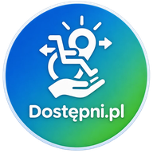

<p align="center"></p>

# Dostępni.pl

**Sprawdź, czy dasz radę wejść, zanim wyjdziesz z domu.** Ocena dostępności miejsc w Krakowie dopasowana do potrzeb
konkretnej osoby. Każda informacja ma źródło, datę i poziom pewności.

Projekt na HackYeah 2026, wyzwanie „Kraków bez barier”. Prezentacja:
[docs/prezentacja/Dostepni-prezentacja.pdf](docs/prezentacja/Dostepni-prezentacja.pdf).

## Problem

Etykieta „dostępne / niedostępne” nie pomaga, bo każdy ma inny próg. Próg 8 cm zatrzyma osobę na wózku,
a dla rodzica z wózkiem dziecięcym jest tylko utrudnieniem. Dziś informacje o dostępności są rozproszone i często
nieaktualne. Nie wiadomo, skąd pochodzą, a brak danych bywa pokazywany jak „dostępne”. Miasto nie ma też zasobów,
by ręcznie utrzymywać bazę tysięcy obiektów.

## Rozwiązanie

Aplikacja na telefon, w której użytkownik:

1. **Wybiera swoje potrzeby**, np. wózek ręczny, wózek elektryczny, wózek dziecięcy, krótkie dystanse albo nawigacja
   bez wzroku. Nie pytamy o niepełnosprawność, tylko o progi i preferencje. Profil zostaje na urządzeniu.
2. **Wyszukuje miejsce** tekstem lub głosem albo pyta asystenta, np. „gdzie zjem bez schodów?”.
3. **Dostaje ocenę dla siebie:**
   - konkretne bariery i udogodnienia: schody, progi, podjazdy, windy, szerokość wejścia, nawierzchnia, toaleta, ławki;
   - werdykt: przeszkoda / utrudnienie / do sprawdzenia / brak danych / w normie;
   - procent pewności oraz źródło i datę każdej informacji.

   Brak danych nigdy nie jest pokazywany jako „dostępne”.

Dane zbieramy automatycznie, bez pracy Miasta i bez dostępu do systemów UMK:

| Źródło | Co daje | Licencja |
|---|---|---|
| OpenStreetMap | wejścia, schody, rampy, windy, toalety, nawierzchnie | ODbL |
| Mapillary + AI (Gemini) | progi i drzwi rozpoznane ze zdjęć ulicznych | CC-BY-SA 4.0 |
| GUS - Bank Danych Lokalnych | bezpieczeństwo okolicy (wypadki drogowe) | CC BY 4.0 |
| Właściciele obiektów | potwierdzone pomiary (weryfikacja kodem) | - |
| Użytkownicy | „zgadza się / nie zgadza się”, poprawki | - |

Informacje z różnych źródeł łączymy według zaufania: wagi źródła, głosów użytkowników i wieku danych.
Sprzeczne dane są oznaczane jako „do sprawdzenia”.

## Co już działa

- Działający prototyp: aplikacja webowa na telefon i otwarte API (FastAPI).
- 5 profili potrzeb z miękkimi i twardymi limitami oraz możliwością ustawienia własnych.
- Pobieranie danych z OpenStreetMap na żądanie, z zapasowymi serwerami, gdy główne nie odpowiadają.
- Analiza zdjęć Mapillary przez AI. Każde zdjęcie jest analizowane tylko raz.
- Statusy danych (potwierdzone / niepotwierdzone / nieaktualne / sprzeczne) i pewność w %.
- Rozdzielenie oceny miejsca i okolicy, np. schody przy sąsiednim budynku.
- Ocena bezpieczeństwa okolicy na podstawie GUS.
- Głosowanie i poprawki od użytkowników oraz formularz dla właścicieli obiektów.
- Asystent AI odpowiadający wyłącznie na podstawie naszych danych, z jawnie oznaczonymi promocjami partnerów.
- Dostępność cyfrowa (cel: WCAG 2.2 AA):
  - kontrast ≥ 5,7:1;
  - obsługa klawiaturą i czytnikiem ekranu;
  - tekstowa wersja mapy;
  - odczyt i wyszukiwanie głosowe.
- Brak kont i brak danych osobowych. Polityka prywatności i regulamin są w aplikacji.
- 165 testów automatycznych, obraz Docker, dokumentacja wdrożenia.

## Cel projektu

Stworzyć wiarygodne źródło informacji o dostępności, które utrzymuje się samo i działa w każdym mieście.
Nowe miasto to dwa ustawienia (`CITY_VIEWBOX`, `GUS_UNIT_ID`). Użytkownik korzysta za darmo, a płacą:

- lokale i hotele: oznaczona promocja, abonament „Partner”;
- firmy: audyty dostępności;
- miasta: raporty, gdzie najpierw usuwać bariery;
- serwisy rezerwacyjne i mapowe: płatne API.

Ocena dostępności nie jest na sprzedaż.

Dalsze plany:
- integracja z Google Maps API (więcej danych o miejscach);
- pilotaż z użytkownikami w Krakowie i audyt WCAG;
- trasy bez schodów;
- kolejne miasta.

## Jak uruchomić

Wymagany Python 3.11+ i git.

```bash
git clone https://github.com/Wojtekvonhajsik/HackYeah.git
cd HackYeah/backend
python -m venv .venv
```

Aktywacja środowiska - Windows (PowerShell):

```bash
.venv\Scripts\activate
```

Linux / macOS:

```bash
source .venv/bin/activate
```

Instalacja i start:

```bash
pip install -e ".[dev]"
uvicorn bezbarier.api.main:app --port 8000
```

Otwórz **http://localhost:8000**. Aplikacja najpierw poprosi o wybór profilu potrzeb, potem możesz wyszukać miejsce,
np. „Sukiennice”. Dokumentacja API jest pod http://localhost:8000/docs.

Klucze są opcjonalne: bez nich aplikacja działa na danych OSM i GUS, a asystent na regułach. Aby włączyć analizę
zdjęć i asystenta AI, skopiuj `backend/.env.example` jako `backend/.env` i uzupełnij `MAPILLARY_TOKEN` oraz
`GEMINI_API_KEY`. Nie commituj pliku `.env`.

Testy:

```bash
pytest
```

Na telefonie aplikację najprościej otworzyć przez darmowy tunel Cloudflare. Instrukcja jest w
[backend/README.md](backend/README.md), a uruchomienie w Dockerze i koszty utrzymania opisuje
[docs/wdrozenie.md](docs/wdrozenie.md).

## Struktura repozytorium

```
backend/             API (FastAPI), klasyfikator, adaptery źródeł danych, testy
backend/web/         aplikacja webowa na telefon (bez kroku budowania)
frontend/src/api/    klient API dla aplikacji mobilnej (Expo)
docs/                projekt klasyfikacji, wdrożenie, API dla frontendu, prezentacja
```

Dane mapy: © współtwórcy OpenStreetMap (ODbL). Zdjęcia: Mapillary (CC-BY-SA 4.0). Statystyki: GUS (CC BY 4.0).
